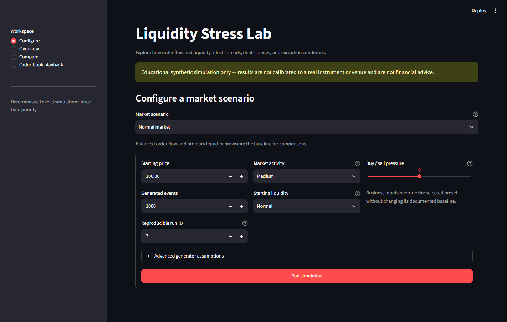

# market-maker

# l3sim

`l3sim` is a deterministic, exchange-agnostic Level 3 limit order book
simulator for research, teaching, and testing market-microstructure ideas. It
models individual resting orders, matches them with price-time priority,
generates reproducible synthetic order flow, and records immutable snapshots
after every event.

> The project is a simulator, not a live trading system or an exchange model
> calibrated to real market data.

## Features

- Individual orders and FIFO queues at every price level
- Limit and market orders, partial fills, cancellation, and modification
- Deterministic price-time-priority matching using exact `Decimal` prices
- Seeded, configurable synthetic order-flow generation
- Immutable L3 snapshots after every input event
- Spread, midpoint, depth, imbalance, and microprice analytics
- A business-facing Liquidity Stress Lab for scenario comparison and playback

## Liquidity Stress Lab

The local Streamlit application turns the simulator into a guided scenario
tool for non-technical users. It answers a practical question: how do changes
in displayed liquidity and order-flow pressure affect spreads, depth, prices,
and execution conditions?

Install the optional application dependencies and launch it in a browser:

```bash
python -m pip install -e ".[app]"
streamlit run streamlit_app.py
```

The application provides four workspaces:



- **Configure** a documented market preset using business-readable controls.
- **Overview** the run through KPIs, interpretations, and time-series charts.
- **Compare** two scenarios with the same reproducible run ID.
- **Order-book playback** to inspect each event, execution, and resulting book.

Five presets are included: normal market, thin liquidity, buy-pressure stress,
sell-pressure stress, and liquidity withdrawal. Raw generator assumptions
remain available in a collapsed advanced section. Summary, time-series, event,
and final-book data can all be downloaded as CSV.

> The lab is an educational synthetic simulation. Results are not calibrated
> to a real instrument or venue and are not financial advice.

### Interview walkthrough

1. Run the **Normal market** preset with the default run ID.
2. Open **Compare**, select **Thin liquidity**, and run the comparison.
3. Explain the changes in average spread, maximum spread, and displayed depth.
4. Open **Order-book playback** and jump to an execution.
5. Use the before/after quotes, ladder, and trade table to explain price-time
   priority and how an aggressive order consumes resting liquidity.

## Installation

`l3sim` requires Python 3.11 or newer.

```bash
python -m pip install l3sim
```

To work from a clone and run the test suite:

```bash
python -m pip install -e ".[test]"
python -m pytest
```

## Quick start

The generator does not mutate the book itself. Pass each generated event to a
`Runner`, which owns the matching engine and records the resulting market
state.

```python
from l3sim.analytics import imbalance, microprice
from l3sim.generator import Generator
from l3sim.simulation import Runner

runner = Runner()
generator = Generator(seed=7, book=runner.engine.book)

# Seed both sides of the book, then simulate reproducible order flow.
runner.run(generator.initial_book_events(levels=4))
for _ in range(100):
    runner.process(generator.next_event())

snapshot = runner.last_snapshot
assert snapshot is not None

print(f"best bid / ask: {snapshot.best_bid} / {snapshot.best_ask}")
print(f"spread:         {snapshot.spread}")
print(f"trades:         {len(runner.engine.trades)}")
print(f"imbalance:      {imbalance(runner.engine.book, levels=3)}")
print(f"microprice:     {microprice(runner.engine.book)}")
```

A configurable command-line example is included at
`examples/run_simulation.py`:

```bash
python examples/run_simulation.py --events 1_000 --seed 7 --levels 5
```

## Architecture

The package keeps the simulation pipeline explicit:

```text
GeneratorConfig -> Generator -> input Event -> Runner -> MatchingEngine
                                                       |        |
                                                       |        +-> Trade
                                                       +-> OrderBook
                                                               |
                                  analytics <- immutable Snapshot
```

The business application is a separate adapter over that pipeline:

```text
Streamlit UI -> ScenarioConfig -> run_scenario -> existing simulation pipeline
                                            |
                                            +-> SimulationResult
                                                (KPIs, rows, playback, CSV)
```

The UI imports only `l3sim.lab`; the matching engine remains independent of
Streamlit and pandas.

- `l3sim.domain` contains orders, events, trades, price levels, and the order
  book.
- `l3sim.matching` applies matching, cancellation, and modification rules.
- `l3sim.generator` produces seeded, book-aware synthetic input events.
- `l3sim.simulation` processes chronological events and captures immutable
  post-event snapshots.
- `l3sim.analytics` calculates read-only book metrics.
- `l3sim.lab` translates business scenarios into generator settings and
  returns presentation-ready results.

## Matching rules

The engine uses price-time priority. An incoming order matches the best price
on the opposing side, then the oldest order at that price. Every execution
uses the resting order's price. A market order consumes available opposing
liquidity and never rests; any unfilled quantity is discarded. A limit order
matches at its limit price or better, and any residual quantity rests in the
book.

Cancellation can remove an order or reduce its outstanding quantity. A
partial cancellation keeps the order's FIFO position.

Modification follows these priority rules:

- Reducing quantity at the same price preserves queue priority.
- Increasing quantity or changing price cancels and resubmits the order, so it
  moves to the back of its new queue.
- A price change can cross the spread and execute immediately.

Quantities passed to `MatchingEngine.modify()` are desired remaining
quantities; quantities passed to `MatchingEngine.cancel()` are amounts to
cancel.

## Synthetic generation

`GeneratorConfig` controls the initial midpoint and tick size, relative event
rates, side probability, quantity distribution, price distance, and simulated
start time. Inter-arrival times are exponentially distributed and quantities
are sampled from a bounded log-normal distribution. The same configuration,
seed, and sequence of book states produce the same events.

Generated ordinary limit orders are passive relative to the current book.
Cancellation and modification target live orders. If one of those actions is
selected while no order is available, the generator emits a limit order so
the event remains processable. The default generator is a useful synthetic
workload, not a calibrated model of a particular venue or asset.

## Analytics and snapshots

The analytics module exposes `best_bid`, `best_ask`, `mid_price`, `spread`,
`bid_depth`, `ask_depth`, `imbalance`, and `microprice`. Metrics that require
liquidity on both sides return `None` when they are undefined.

`Runner` records a `Snapshot` after every event. Snapshots retain the event,
trades produced by it, top-of-book values, aggregate depth, last-trade data,
and immutable copies of every resting L3 order.

## Current limitations

- One instrument and one continuous trading session per engine
- No auctions, hidden/iceberg orders, pegged orders, or venue-specific order
  types
- No fees, rebates, latency, network model, or self-trade prevention
- No persistence, market-data feed, or live exchange connectivity
- Synthetic flow is not statistically calibrated to historical observations
- Prices are exact decimals, but tick-size enforcement is the caller's
  responsibility for manually constructed orders

## Development

Run all deterministic and property-based tests with:

```bash
python -m pytest
```

To include the Streamlit smoke tests, install both optional dependency groups:

```bash
python -m pip install -e ".[test,app]"
python -m pytest
```
